<p align="center">
  
</p>

<h1 align="center">Simulate <em>anything.</em></h1>

<p align="center">
  <strong>Star us&nbsp;❤️&nbsp;→</strong>&nbsp;
  <a href="https://github.com/MiroShark/MiroShark/stargazers"></a> &nbsp;·&nbsp;
  <a href="https://www.miroshark.xyz/docs"></a> &nbsp;·&nbsp;
  <a href="https://x.com/miroshark_"></a> &nbsp;·&nbsp;
  <a href="https://bankr.bot/discover/0xd7bc6a05a56655fb2052f742b012d1dfd66e1ba3"></a>
</p>

<p align="center">
  <b>$1</b> · per simulation &nbsp;·&nbsp; <b>10 min</b> · first result &nbsp;·&nbsp; <b>100+</b> · grounded agents
</p>

<div align="center">

[](https://github.com/MiroShark/MiroShark/stargazers)
[](https://github.com/MiroShark/MiroShark/network/members)
[](../LICENSE)
[](https://www.python.org/)
[](https://nodejs.org/)

</div>

<p align="center">
  <b>English</b> · <a href="README.zh-CN.md">中文</a> · <a href="README.ja.md">日本語</a> · <a href="README.fr.md">Français</a>
</p>

<br/>

<p align="center">
  
</p>

<br/><br/>

<h2 align="center">What it does</h2>

<!-- NEW IMAGE: what-it-does.jpg -->
<p align="center">
  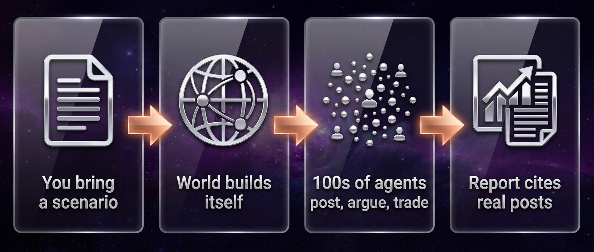
</p>

<br/>

<h3 align="center">Get started</h3>

```bash
git clone https://github.com/aaronjmars/MiroShark.git && cd MiroShark
cp .env.example .env    # paste one OpenRouter key
./miroshark             # deps + Neo4j + servers → http://localhost:3000
```

<p align="center">
  <a href="../docs/INSTALL.md"></a>
</p>

<br/><br/>

<h2 align="center">How it <em>works</em></h2>

<p align="center">
  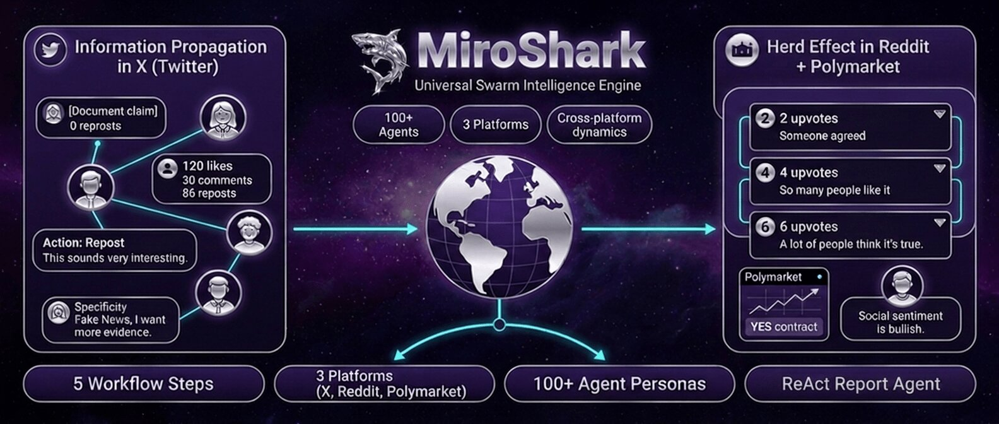
</p>

<p align="center">
  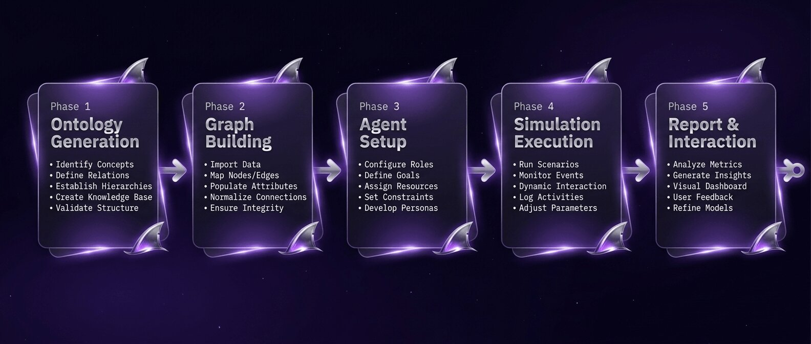
</p>

<br/><br/>

<h2 align="center">Grounded agents</h2>

<p align="center">Not roleplay. Every agent is grounded in five layers of real context.</p>

<p align="center">
  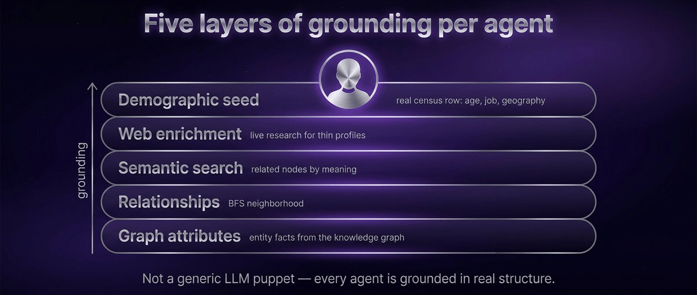
</p>

<br/><br/>

<h2 align="center">Graph memory</h2>

<p align="center">
  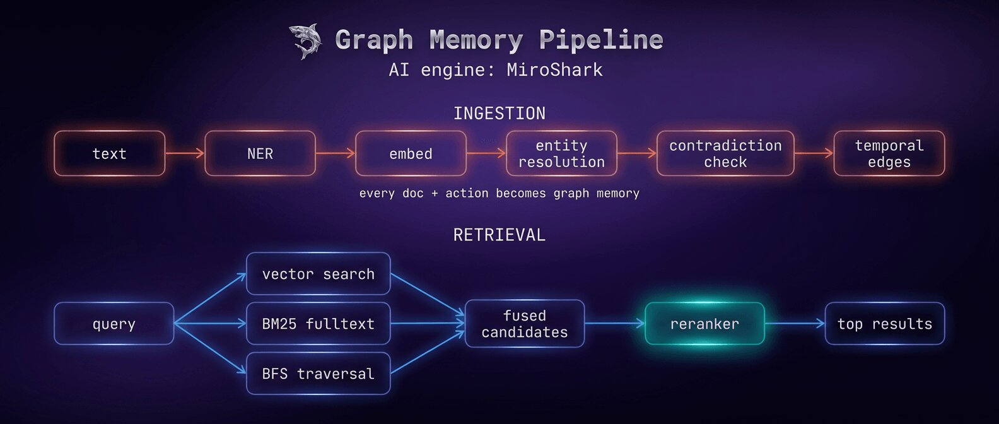
</p>

<br/><br/>

<h2 align="center">What can you <em>simulate?</em></h2>

<!-- NEW IMAGE CARDS: one per use case, clickable → docs/FEATURES.md -->
<p align="center">
  <a href="../docs/FEATURES.md" title="PR crisis testing — simulate public reaction to a press release before you publish">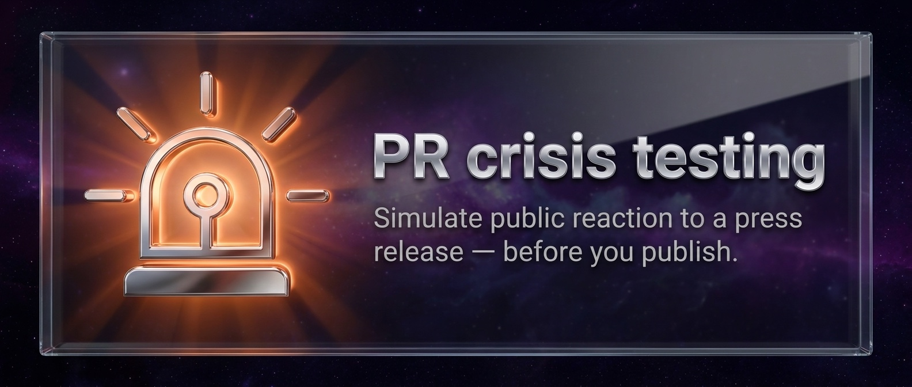</a>
</p>
<p align="center">
  <a href="../docs/FEATURES.md" title="Market reaction — feed financial news, watch simulated trader and investor sentiment move a prediction market">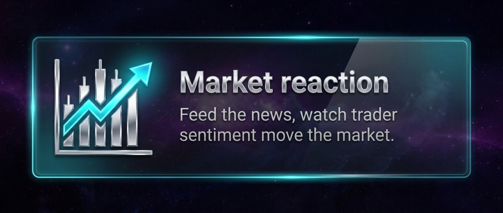</a>
</p>
<p align="center">
  <a href="../docs/FEATURES.md" title="Advertising — test a campaign, headline, or pitch against a simulated audience before you spend">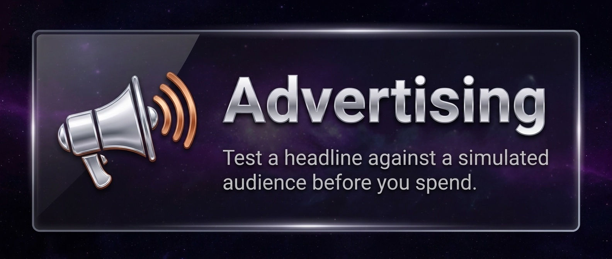</a>
</p>
<p align="center">
  <a href="../docs/FEATURES.md" title="Policy analysis — test draft regulations against a simulated public">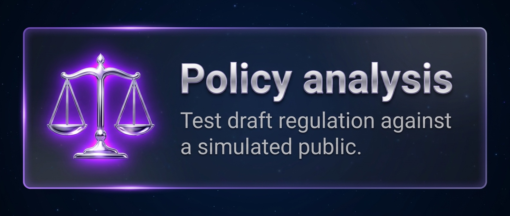</a>
</p>
<p align="center">
  <a href="../docs/FEATURES.md" title="What-if history — rewrite a historical event and watch a population of personas re-narrate the aftermath">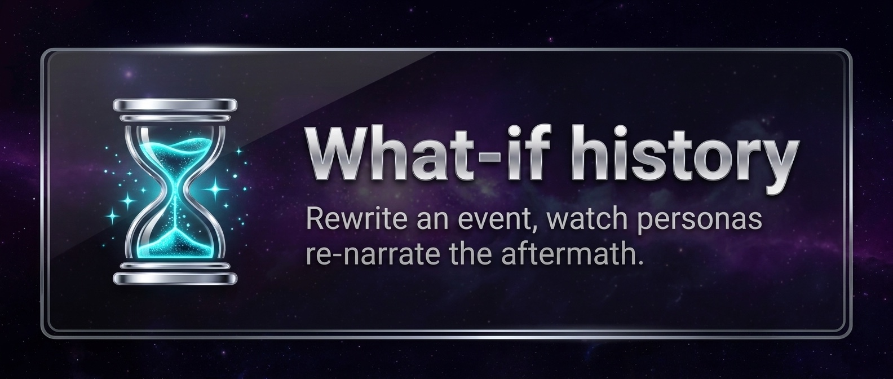</a>
</p>
<p align="center">
  <a href="../docs/FEATURES.md" title="Creative experiments — feed a novel with a lost ending and agents write a narratively consistent conclusion">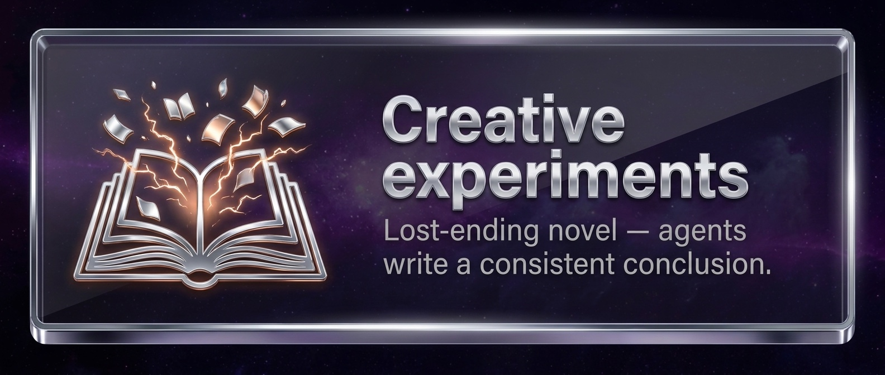</a>
</p>

<br/><br/>

<h2 align="center">Features</h2>

<!-- NEW IMAGE: feature-wall.jpg — the 8 marquee features as one glass-tile grid -->
<p align="center">
  <a href="../docs/FEATURES.md" title="See the full feature list and deep dives"></a>
</p>

<p align="center"><a href="../docs/FEATURES.md"><b>40+ features · full list and deep dives →</b></a></p>

<br/><br/>

<h2 align="center">Docs</h2>

<p align="center">
  <a href="../docs/INSTALL.md"></a>
  <a href="../docs/CONFIGURATION.md"></a>
  <a href="../docs/MODELS.md"></a>
  <a href="../docs/ARCHITECTURE.md"></a>
  <a href="../docs/API.md"></a>
  <a href="../docs/CLI.md"></a>
  <a href="../docs/MCP.md"></a>
  <a href="../docs/WEBHOOKS.md"></a>
  <a href="../docs/DKG.md"></a>
  <a href="../docs/WAYBACKCLAW.md"></a>
  <a href="../ECOSYSTEM.md"></a>
</p>

<br/><br/>

<h2 align="center">Community</h2>

<table width="100%" border="0" cellspacing="0" role="presentation">
  <tr>
    <td align="center" valign="middle" width="33%">
      <a href="https://x.com/miroshark_" title="Follow @miroshark_ on X">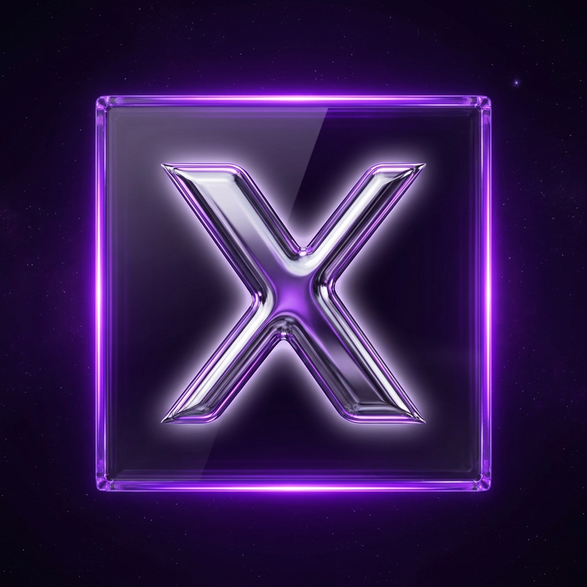</a>
    </td>
    <td align="center" valign="middle" width="33%">
      <a href="https://www.miroshark.xyz/docs" title="Read the MiroShark docs">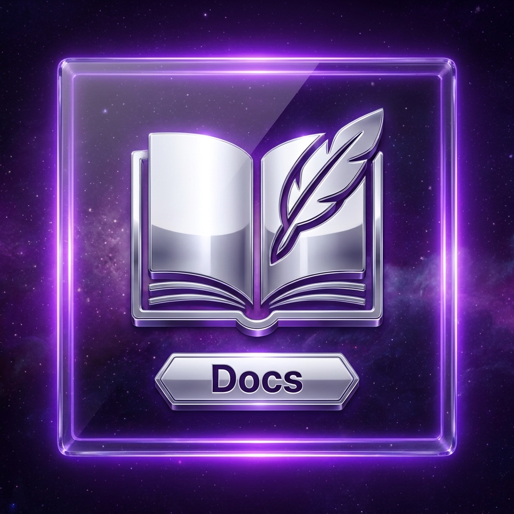</a>
    </td>
    <td align="center" valign="middle" width="33%">
      <a href="https://bankr.bot/discover/0xd7bc6a05a56655fb2052f742b012d1dfd66e1ba3" title="$miroshark on Bankr">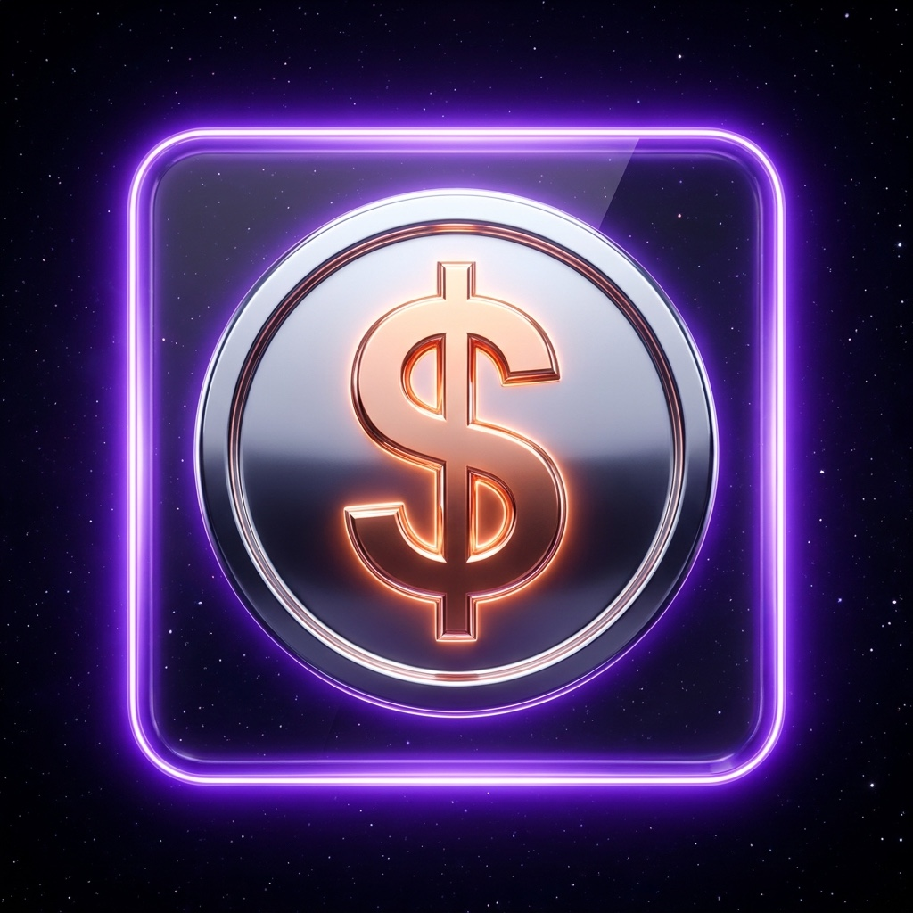</a>
    </td>
  </tr>
</table>

<br/><br/>

<p align="center"><sub>AGPL-3.0 · Support the project: <code>0xd7bc6a05a56655fb2052f742b012d1dfd66e1ba3</code> 🦈</sub></p>
